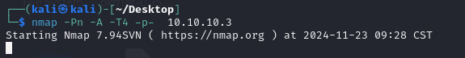
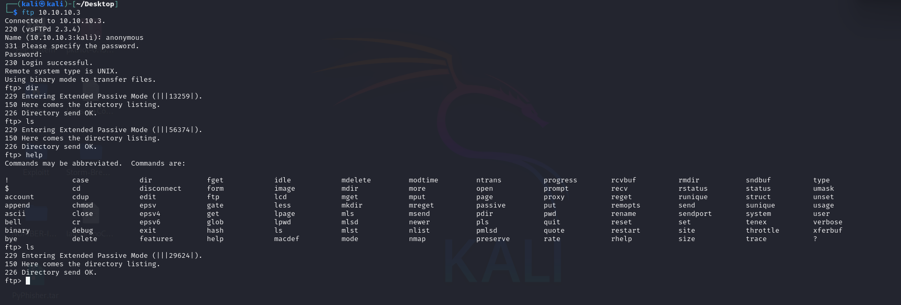
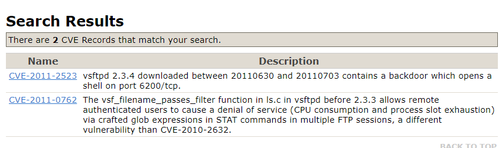
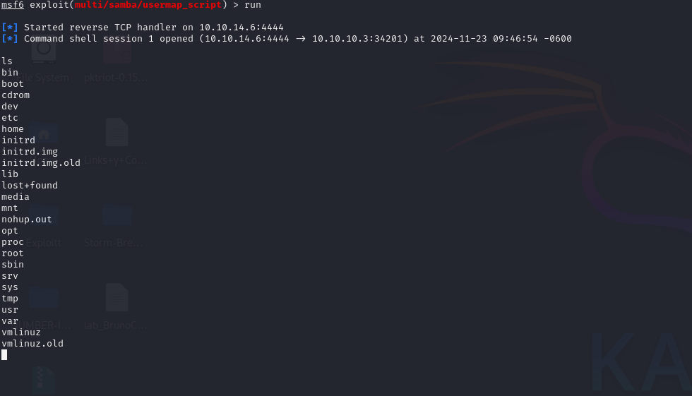
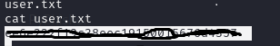
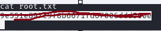

# LameHTB
Machine Lame Hack The Box 

## RECON 

**Nmap**
Scan all ports using nmap 

we discover  4  TCP ports open:

Discovered open port 139/tcp on 10.10.10.3
Discovered open port 21/tcp on 10.10.10.3
Discovered open port 445/tcp on 10.10.10.3
Discovered open port 22/tcp on 10.10.10.3

**Services**

21/tcp   open  ftp         syn-ack vsftpd 2.3.4

22/tcp   open  ssh         syn-ack OpenSSH 4.7p1 Debian 8ubuntu1 (protocol 2.0)

139/tcp  open  netbios-ssn syn-ack Samba smbd 3.X - 4.X (workgroup: WORKGROUP)

445/tcp  open  netbios-ssn syn-ack Samba smbd 3.0.20-Debian (workgroup: WORKGROUP)

3632/tcp open  distccd     syn-ack distccd v1 ((GNU) 4.2.4 (Ubuntu 4.2.4-1ubuntu4))

We canm able to conect to 21 ftp service usinmg Anonymous user.

but i see nothing 

Search for a cve for the ftp service.

i fiond a metasploit module to run exploit the machine but is not working.

Now try samba port.

and find **CVE-2007-2447** vulberability 

## Exploit 

Using Metasploit Module to theis vulnerabiulity

and im **ROOT* 😈

i find user falg in makis directory

And the root Flag in root difrectory

